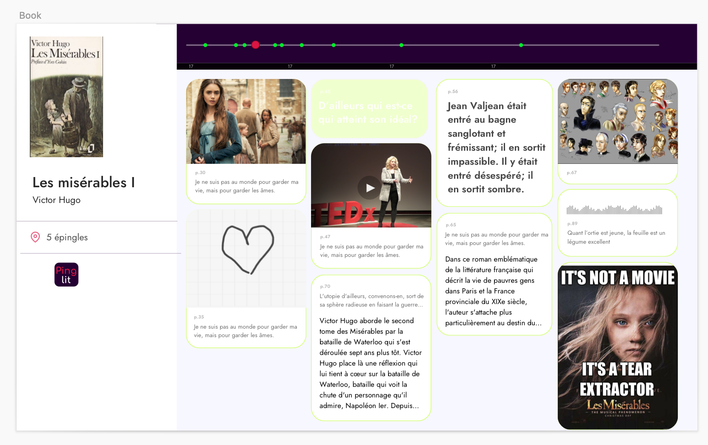

Created in collaboration with Emmanuelle Germain, a French literature high-school teacher.
Grand Prize Winner of the Education stream of the Post COVID challenge 2020 organized by the Cooperation and Desjardins.

With Pinglit, students collaboratively comment and exchange with their friends on the books they are reading.

As they read the book, students create and comment on multimedia pins that can contain images, sounds, videos, links, etc. The pins are organized on a horizontal timeline so that they relate to a passage of the book. Zooming out on the interface displays beautiful multi-sensorial summaries of the student’s impressions of the book. Students treat the app like a repository of all the books they read and the emotions and thoughts that each sparked.

Teachers can use Pinglit in their classes to spark discussions between students, provide helpful notes on sections of the books to facilitate understanding, and reading comprehension quizzes at the end of certain chapters.

Pinglit won the Post COVID Challenge for which the ask was to facilitate the evaluation of students in an online learning context.
